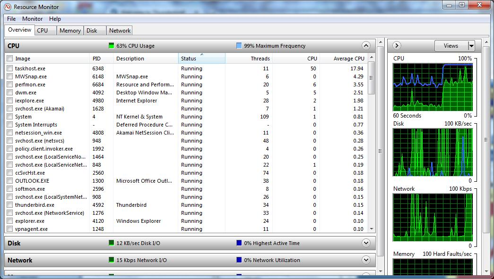

原文地址：[https://computing.llnl.gov/tutorials/pthreads/](https://computing.llnl.gov/tutorials/pthreads/ "POSIX Threads Programming")

# POSIX Threads Programming
1. Abstract
2. Pthreads Overview
    1. What is a Thread?
    2. What are Pthreads?
    3. Why Pthreads?
    4. Designing Threaded Programs
3. The Pthreads API
4. Compiling Threaded Programs
5. Thread Management
    1. Creating and Terminating Threads
    2. Passing Arguments to Threads
    3. Joining and Detaching Threads
    4. Stack Management
    5. Miscellaneous Routines
6. Exercise 1
7. Mutex Variables
    1. Mutex Variables Overview
    2. Creating and Destroying Mutexes
    3. Locking and Unlocking Mutexes
8. Condition Variables
    1. Condition Variables Overview
    2. Creating and Destroying Condition Variables
    3. Waiting and Signaling on Condition Variables
9. Monitoring, Debugging and Performance Analysis Tools for Pthreads
10. LLNL Specific Information and Recommendations
11. Topics Not Covered
12. Exercise 2
13. References and More Information
14. Appendix A: Pthread Library Routines Reference

## Abstract
## 摘要
In shared memory multiprocessor architectures, threads can be used to implement parallelism. Historically, hardware vendors have implemented their own proprietary versions of threads, making portability a concern for software developers. For UNIX systems, a standardized C language threads programming interface has been specified by the IEEE POSIX 1003.1c standard. Implementations that adhere to this standard are referred to as POSIX threads, or Pthreads.

在共享内存的多处理器架构中，线程可以被用来实现并行计算。由于历史原因，硬件供应商实现了他们自己私有版本的线程，这使得软件开发者不得不考虑可移植性。对于UNIX系统，一种标准的C语言线程编程接口被IEEE POSIX 1003.1c标准所指定。在此所述的对该标准的实现被称之为POSIX线程，也称之为Pthreads。

The tutorial begins with an introduction to concepts, motivations, and design considerations for using Pthreads. Each of the three major classes of routines in the Pthreads API are then covered: Thread Management, Mutex Variables, and Condition Variables. Example codes are used throughout to demonstrate how to use most of the Pthreads routines needed by a new Pthreads programmer. The tutorial concludes with a discussion of LLNL specifics and how to mix MPI with pthreads. A lab exercise, with numerous example codes (C Language) is also included.

本教程从对概念、动机、设计考虑的介绍开始。然后覆盖Pthreads API中三个主要的例程类型：线程管理、互斥变量、条件变量。从头到尾的示例代码用来展示一个Pthread新手需要的绝大部分Pthread例程。本教程以对LLNL的细节讨论和如何将Pthread与MPI结合作为结束。同时还包含一个拥有大量C语言示例代码的实验练习。

Level/Prerequisites: This tutorial is one of the eight tutorials in the 4+ day "Using LLNL's Supercomputers" workshop. It is deal for those who are new to parallel programming with threads. A basic understanding of parallel programming in C is required. For those who are unfamiliar with Parallel Programming in general, the material covered in [EC3500: Introduction To Parallel Computing](https://computing.llnl.gov/tutorials/parallel_comp) would be helpful. 

水平/前置条件：本教程是4+天“使用LLNL的超级计算机”进修班8篇教程中的一篇。它是那些刚刚接触使用线程进行并行编程的人的理想教程。需要基本理解在C语言中进行并行编程。对于那此连并行编程的大概都不了解的人，建议先看看[EC3500: 并行编程简介](https://computing.llnl.gov/tutorials/parallel_comp)里提到的资料，应该会有帮助。

## Pthreads Overview
## Pthread概述

### What is a Thread?
### 线程是什么？

- Technically, a thread is defined as an independent stream of instructions that can be scheduled to run as such by the operating system. But what does this mean?
- 从技术上讲，线程被定义为一个独立的指令流，它能被作系统调度进而运行。但是这是什么意思？
- To the software developer, the concept of a "procedure" that runs independently from its main program may best describe a thread.
- 对软件开发者而言，某个“过程”能独立于主程序运行这样的概念也许最能描述线程。
- To go one step further, imagine a main program (a.out) that contains a number of procedures. Then imagine all of these procedures being able to be scheduled to run simultaneously and/or independently by the operating system. That would describe a "multi-threaded" program.
- 更进一步，想像一个包含许多过程的主程序（a.out）。然后想像所有这些过程能够被操作系统调度成独立或者不独立地同时执行。这就描述一个“多线程”程序。
- How is this accomplished?
- 这是如何完成的？
- Before understanding a thread, one first needs to understand a UNIX process. A process is created by the operating system, and requires a fair amount of "overhead". Processes contain information about program resources and program execution state, including:
- 在理解线程之前，你需要先理解UNIX的进程。一个进程被操作系统创建，并且请求相当数量的“开销”。进程包含程序资源与程序执行状态的信息，包括：

    - Process ID, process group ID, user ID, and group ID
    - 进程ID、进程组ID、用户ID、组ID
    - Environment
    - 环境变量
    - Working directory
    - 工作目录
    - Program instructions
    - 程序执令
    - Registers
    - 寄存器
    - Stack
    - 栈
    - Heap
    - 堆
    - File descriptors
    - 文件描述符
    - Signal actions
    - 信号动作
    - Shared libraries
    - 共享库
    - Inter-process communication tools (such as message queues, pipes, semaphores, or shared memory)
    - 进程间通讯工具（例如消息队列、管道、信号量以及共享内存）
    - 
    - 
- Threads use and exist within these process resources, yet are able to be scheduled by the operating system and run as independent entities largely because they duplicate only the bare essential resources that enable them to exist as executable code.
- 线程使用进程的资源且位于进程资源内，却能被操作系统当成独立实体调度并且独立执行，这主要是因为它们仅复制了让它们成为可执行代码刚刚够的必须的资源。
- This independent flow of control is accomplished because a thread maintains its own:
- 能做到独立控制流是因为线程维护着它自己的：
    - Stack pointer
    - 栈指针
    - Registers
    - 寄存器
    - Scheduling properties (such as policy or priority)
    - 调度属性（例如策略与优先级）
    - Set of pending and blocked signals
    - 一系列等待的与阻塞的信号
    - Thread specific data
    - 线程特有数据
- So, in summary, in the UNIX environment a thread:
- 综上，在UNIX环境下，一个线程：
    - Exists within a process and uses the process resources
    - 存在于一个进程里面并且使用该进程的资源
    - Has its own independent flow of control as long as its parent process exists and the OS supports it
    - 拥有它自己独立的控制流，只要它的父进程存在并且操作系统支持
    - Duplicates only the essential resources it needs to be independently schedulable
    - 仅复制独立调度所必须的资源
    - May share the process resources with other threads that act equally independently (and dependently)
    - 可能与行为同样独立（或者依赖）的其他线程共享进程资源
    - Dies if the parent process dies - or something similar
    - 因父进程挂掉而挂掉——或者其他类似的规则
    - Is "lightweight" because most of the overhead has already been accomplished through the creation of its process
    - 是轻量级的，因为大部分开销已经在创建进程的时候完成了。
- Because threads within the same process share resources:
- 因为属于同一个进程线程们共享资源，所以：
    - Changes made by one thread to shared system resources (such as closing a file) will be seen by all other threads.
    - 由某个线程引起的对共享系统资源的变更（比如关闭一个文件）将会被其他所有线程看见。
    - Two pointers having the same value point to the same data.
    - 拥有相同值的两个指针指向同一块数据。
    - Reading and writing to the same memory locations is possible, and therefore requires explicit synchronization by the programmer.
    - 同时读和写同一个内存地址是可能的，因此需要编程人员作出明确的同步。

### What are Pthreads?
### Pthread是什么？
- Historically, hardware vendors have implemented their own proprietary versions of threads. These implementations differed substantially from each other making it difficult for programmers to develop portable threaded applications.
- 由于历史原因，硬件供应商实现了他们自己的专有的线程版本。这些实现相互之间有大量的不同，这使得程序员开发可移植的多线程应用变得很难。
- In order to take full advantage of the capabilities provided by threads, a standardized programming interface was required.
- 为了充分利用线程提供的能力，一个标准化的编程接口不可缺少。
    - For UNIX systems, this interface has been specified by the IEEE POSIX 1003.1c standard (1995).
    - 对UNIX系统而言，这个接口被IEEE POSIX 1003.1c标准所指定。
    - Implementations adhering to this standard are referred to as POSIX threads, or Pthreads.
    - 在这里所指的对标准的实现称为POSIX线程，也叫Pthread。
    - Most hardware vendors now offer Pthreads in addition to their proprietary API's.
    - 大多数硬件供应商现在除了他们专有的API之外都提供了Pthread。
- The POSIX standard has continued to evolve and undergo revisions, including the Pthreads specification.
- POSIX标准一直在发展并经受修订，包括Pthread设计规格。
- Some useful links:
- 一些有用的链接：
    - [POSIX 1003.1-2008](http://standards.ieee.org/findstds/standard/1003.1-2008.html)
    - [posix faq](www.opengroup.org/austin/papers/posix_faq.html)
    - [ieee std](www.unix.org/version3/ieee_std.html)
- Pthreads are defined as a set of C language programming types and procedure calls, implemented with a pthread.h header/include file and a thread library - though this library may be part of another library, such as libc, in some implementations.
- Pthread被定义为一系列C语言编程里的类型和过程调用，随一个pthread.h头文件/include文件以及一个线程库而实现。尽管在某些实现里，这线程库是作为另一个库的一部分而存在，例如libc。

### Why Pthreads?
### 为什么是Pthread？
#### Light Weight:
#### 轻量
- When compared to the cost of creating and managing a process, a thread can be created with much less operating system overhead. Managing threads requires fewer system resources than managing processes.
- 与创建和管理一个进程的消耗相比，一个线程能以相当少的操作系统开销创建出来。管理线程比管理进程所需系统资源更少。
- For example, the following table compares timing results for the fork() subroutine and the pthread_create() subroutine. Timings reflect 50,000 process/thread creations, were performed with the time utility, and units are in seconds, no optimization flags.
- 比如说，下表比较了fork()子例程和pthread_create()子例程在时间上的消耗结果。时间反映了50000个进程/线程的创建，用time工具命令执行，单位为秒，没有使用优化标记。

Note: don't expect the sytem and user times to add up to real time, because these are SMP systems with multiple CPUs/cores working on the problem at the same time. At best, these are approximations run on local machines, past and present.

注释：不要妄想系统时间加上用户时间等于实际时间，因为这些是对称多处理器（SMP）系统，拥有多个CPU/核心同时在问题上工作。充其量，在本地机上运行时它们相近，过去与现在。（好别扭的一句话）

<table>
    <thead>
        <tr>
            <th rowspan="2">Platform</th>
            <th colspan="3">fork()</th>
            <th colspan="3">pthread_create()</th>
        </tr>
        <tr>
            <th>real</th>
            <th>user</th>
            <th>sys</th>
            <th>real</th>
            <th>user</th>
            <th>sys</th>
        </tr>
    </thead>
    <tbody>
        <tr>
            <td>Intel 2.6 GHz Xeon E5-2670 (16 cores/node)</td>
            <td>8.1</td>
            <td>0.1</td>
            <td>2.9</td>
            <td>0.9</td>
            <td>0.2</td>
            <td>0.3</td>
        </tr>
        <tr>
            <td>Intel 2.8 GHz Xeon 5660 (12 cores/node)</td>
            <td>4.4</td>
            <td>0.4</td>
            <td>4.3</td>
            <td>0.7</td>
            <td>0.2</td>
            <td>0.5</td>
        </tr>
        <tr>
            <td>AMD 2.3 GHz Opteron (16 cores/node)</td>
            <td>12.5</td>
            <td>1.0</td>
            <td>12.5</td>
            <td>1.2</td>
            <td>0.2</td>
            <td>1.3</td>
        </tr>
        <tr>
            <td>AMD 2.4 GHz Opteron (8 cores/node)</td>
            <td>17.6</td>
            <td>2.2</td>
            <td>15.7</td>
            <td>1.4</td>
            <td>0.3</td>
            <td>1.3</td>
        </tr>
        <tr>
            <td>IBM 4.0 GHz POWER6 (8 cpus/node)</td>
            <td>9.5</td>
            <td>0.6</td>
            <td>8.8</td>
            <td>1.6</td>
            <td>0.1</td>
            <td>0.4</td>
        </tr>
        <tr>
            <td>IBM 1.9 GHz POWER5 p5-575 (8 cpus/node)</td>
            <td>64.2</td>
            <td>30.7</td>
            <td>27.6</td>
            <td>1.7</td>
            <td>0.6</td>
            <td>1.1</td>
        </tr>
        <tr>
            <td>IBM 1.5 GHz POWER4 (8 cpus/node)</td>
            <td>104.5</td>
            <td>48.6</td>
            <td>47.2</td>
            <td>2.1</td>
            <td>1.0</td>
            <td>1.5</td>
        </tr>
        <tr>
            <td>INTEL 2.4 GHz Xeon (2 cpus/node)</td>
            <td>54.9</td>
            <td>1.5</td>
            <td>20.8</td>
            <td>1.6</td>
            <td>0.7</td>
            <td>0.9</td>
        </tr>
        <tr>
            <td>INTEL 1.4 GHz Itanium2 (4 cpus/node)</td>
            <td>54.5</td>
            <td>1.1</td>
            <td>22.2</td>
            <td>2.0</td>
            <td>1.2</td>
            <td>0.6</td>
        </tr>
    </tbody>
</table>

Source: [fork vs thread](https://computing.llnl.gov/tutorials/pthreads/fork_vs_thread.txt "fork_vs_thread.txt")

#### Efficient communications/Data Exchange:
#### 高效的交流/数据交换
- The primary motivation for considering the use of Pthreads on a multi-processor architecture is to achieve optimum performance. In particular, if an application is using MPI for on-node communications, there is a potential that performance could be improved by using Pthreads instead.
- 考虑在多处理器架构上用Pthread的主要动机是达到最佳性能。特别是如果一个应用使用MPI做单点交流，那么有很有可能通过使用Pthread代替MPI让性能得到提升。
- MPI libraries usually implement on-node task communication via shared memory, which involves at least one memory copy operation (process to process).
- MPI库通常通过共享内存实现单点任务沟通，这至少牵扯到内存复制操作（进程到进程）。
- For Pthreads there is no intermediate memory copy required because threads share the same address space within a single process. There is no data transfer, per se. It can be as efficient as simply passing a pointer.
- 对Pthread来说不存在中间内存复制的需求，因为在同一个单独进程里面线程们共享相同的地址空间。本质上没有数据传输。它可以做到仅仅传输一个指针那样的高效。
- In the worst case scenario, Pthread communications become more of a cache-to-CPU or memory-to-CPU bandwidth issue. These speeds are much higher than MPI shared memory communications.
- 在最糟糕的情况下，Pthread交流更多地成为一个缓存至CPU或者CPU至缓存带宽问题。它们的速度远比MPI的内存交流快得多。
- For example: some local comparisons, past and present, are shown below:
- 比如：下面展示了过去与现在的一些本地比较：

<table>
    <thead>
        <tr>
            <th>Platform</th>
            <th>MPI Shared Memory Bandwidth (GB/sec)</th>
            <th>Pthreads Worst Case Memory-to-CPU Bandwidth  (GB/sec)</th>
        </tr>
    </thead>
    <tbody>
        <tr>
            <td>Intel 2.6 GHz Xeon E5-2670</td>
            <td>4.5</td>
            <td>51.2</td>
        </tr>
        <tr>
            <td>Intel 2.8 GHz Xeon 5660</td>
            <td>5.6</td>
            <td>32</td>
        </tr>
        <tr>
            <td>AMD 2.3 GHz Opteron</td>
            <td>1.8</td>
            <td>5.3</td>
        </tr>
        <tr>
            <td>AMD 2.4 GHz Opteron</td>
            <td>1.2</td>
            <td>5.3</td>
        </tr>
        <tr>
            <td>IBM 1.9 GHz POWER5 p5-575</td>
            <td>4.1</td>
            <td>16</td>
        </tr>
        <tr>
            <td>IBM 1.5 GHz POWER4</td>
            <td>2.1</td>
            <td>4</td>
        </tr>
        <tr>
            <td>Intel 2.4 GHz Xeon</td>
            <td>0.3</td>
            <td>4.3</td>
        </tr>
        <tr>
            <td>Intel 1.4 GHz Itanium 2</td>
            <td>1.8</td>
            <td>6.4</td> 
        </tr>
    </tbody>
</table>

#### Other Common Reasons:
#### 其他常见原因：
- Threaded applications offer potential performance gains and practical advantages over non-threaded applications in several other ways:
- 在其他许多方面，多线程应用提供了潜在的性能收益和在非多线程应用之上的实用的优势：
    - Overlapping CPU work with I/O: For example, a program may have sections where it is performing a long I/O operation. While one thread is waiting for an I/O system call to complete, CPU intensive work can be performed by other threads.
    - 重叠的CPU工作与I/O：例如，一个程序可能拥有某个执行长时间I/O操作的区块。仅管其中一个线程在等待I/O系统调用的结束，CPU密集的工作可以在另一个线程执行。
    - Priority/real-time scheduling: tasks which are more important can be scheduled to supersede or interrupt lower priority tasks.
    - 优先级/实时调度：更重要的任务可以在调度时取代或者中断低优先级的任务。
    - Asynchronous event handling: tasks which service events of indeterminate frequency and duration can be interleaved. For example, a web server can both transfer data from previous requests and manage the arrival of new requests.
    - 异步的事件处理：服务不确定频率和持续时间的事件的任务可以交错进行。例如一个Web服务既可以传输先前的请求的数据也可以处理新到来的请求。
- A perfect example is the typical web browser, where many interleaved tasks can be happening at the same time, and where tasks can vary in priority.
- 一个完美的例子是典型的WEB浏览器，在这里许多交错的任务在同时发生，任务的优先级可以不同。
- Another good example is a modern operating system, which makes extensive use of threads. A screenshot of the MS Windows OS and applications using threads is shown below.
- 另一个好例子是现代操作系统，它广泛地使用了线程。下面展示了微软Windows操作系统和应用程序使用的线程的屏幕截图。

