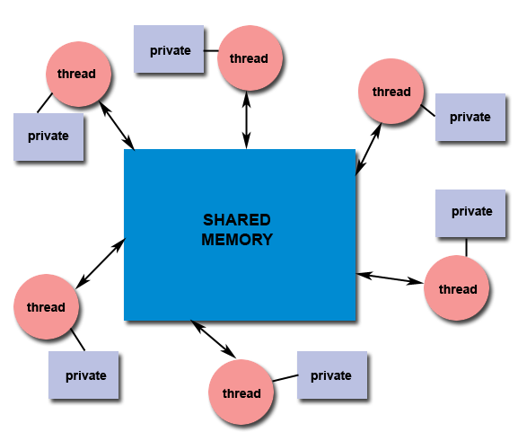

原文地址：[https://computing.llnl.gov/tutorials/pthreads/](https://computing.llnl.gov/tutorials/pthreads/ "POSIX Threads Programming")

# POSIX Threads Programming
1. Abstract
2. Pthreads Overview
    1. What is a Thread?
    2. What are Pthreads?
    3. Why Pthreads?
    4. Designing Threaded Programs
3. The Pthreads API
4. Compiling Threaded Programs
5. Thread Management
    1. Creating and Terminating Threads
    2. Passing Arguments to Threads
    3. Joining and Detaching Threads
    4. Stack Management
    5. Miscellaneous Routines
6. Exercise 1
7. Mutex Variables
    1. Mutex Variables Overview
    2. Creating and Destroying Mutexes
    3. Locking and Unlocking Mutexes
8. Condition Variables
    1. Condition Variables Overview
    2. Creating and Destroying Condition Variables
    3. Waiting and Signaling on Condition Variables
9. Monitoring, Debugging and Performance Analysis Tools for Pthreads
10. LLNL Specific Information and Recommendations
11. Topics Not Covered
12. Exercise 2
13. References and More Information
14. Appendix A: Pthread Library Routines Reference

## Abstract
## 摘要
In shared memory multiprocessor architectures, threads can be used to implement parallelism. Historically, hardware vendors have implemented their own proprietary versions of threads, making portability a concern for software developers. For UNIX systems, a standardized C language threads programming interface has been specified by the IEEE POSIX 1003.1c standard. Implementations that adhere to this standard are referred to as POSIX threads, or Pthreads.

在共享内存的多处理器架构中，线程可以被用来实现并行计算。由于历史原因，硬件供应商实现了他们自己私有版本的线程，这使得软件开发者不得不考虑可移植性。对于UNIX系统，一种标准的C语言线程编程接口被IEEE POSIX 1003.1c标准所指定。在此所述的对该标准的实现被称之为POSIX线程，也称之为Pthreads。

The tutorial begins with an introduction to concepts, motivations, and design considerations for using Pthreads. Each of the three major classes of routines in the Pthreads API are then covered: Thread Management, Mutex Variables, and Condition Variables. Example codes are used throughout to demonstrate how to use most of the Pthreads routines needed by a new Pthreads programmer. The tutorial concludes with a discussion of LLNL specifics and how to mix MPI with pthreads. A lab exercise, with numerous example codes (C Language) is also included.

本教程从对概念、动机、设计考虑的介绍开始。然后覆盖Pthreads API中三个主要的例程类型：线程管理、互斥变量、条件变量。从头到尾的示例代码用来展示一个Pthread新手需要的绝大部分Pthread例程。本教程以对LLNL的细节讨论和如何将Pthread与MPI结合作为结束。同时还包含一个拥有大量C语言示例代码的实验练习。

Level/Prerequisites: This tutorial is one of the eight tutorials in the 4+ day "Using LLNL's Supercomputers" workshop. It is deal for those who are new to parallel programming with threads. A basic understanding of parallel programming in C is required. For those who are unfamiliar with Parallel Programming in general, the material covered in [EC3500: Introduction To Parallel Computing](https://computing.llnl.gov/tutorials/parallel_comp) would be helpful. 

水平/前置条件：本教程是4+天“使用LLNL的超级计算机”进修班8篇教程中的一篇。它是那些刚刚接触使用线程进行并行编程的人的理想教程。需要基本理解在C语言中进行并行编程。对于那些连并行编程的大概都不了解的人，建议先看看[EC3500: 并行编程简介](https://computing.llnl.gov/tutorials/parallel_comp)里提到的资料，应该会有帮助。

## Pthreads Overview
## Pthread概述

### What is a Thread?
### 线程是什么？

- Technically, a thread is defined as an independent stream of instructions that can be scheduled to run as such by the operating system. But what does this mean?
- 从技术上讲，线程被定义为一个独立的指令流，它能被作系统调度进而运行。但是这是什么意思？
- To the software developer, the concept of a "procedure" that runs independently from its main program may best describe a thread.
- 对软件开发者而言，某个“过程”能独立于主程序运行这样的概念也许最能描述线程。
- To go one step further, imagine a main program (a.out) that contains a number of procedures. Then imagine all of these procedures being able to be scheduled to run simultaneously and/or independently by the operating system. That would describe a "multi-threaded" program.
- 更进一步，想像一个包含许多过程的主程序（a.out）。然后想像所有这些过程能够被操作系统调度成独立或者不独立地同时执行。这就描述一个“多线程”程序。
- How is this accomplished?
- 这是如何完成的？
- Before understanding a thread, one first needs to understand a UNIX process. A process is created by the operating system, and requires a fair amount of "overhead". Processes contain information about program resources and program execution state, including:
- 在理解线程之前，你需要先理解UNIX的进程。一个进程被操作系统创建，并且请求相当数量的“开销”。进程包含程序资源与程序执行状态的信息，包括：

    - Process ID, process group ID, user ID, and group ID
    - 进程ID、进程组ID、用户ID、组ID
    - Environment
    - 环境变量
    - Working directory
    - 工作目录
    - Program instructions
    - 程序执令
    - Registers
    - 寄存器
    - Stack
    - 栈
    - Heap
    - 堆
    - File descriptors
    - 文件描述符
    - Signal actions
    - 信号动作
    - Shared libraries
    - 共享库
    - Inter-process communication tools (such as message queues, pipes, semaphores, or shared memory)
    - 进程间通讯工具（例如消息队列、管道、信号量以及共享内存）
    - 
    - 
- Threads use and exist within these process resources, yet are able to be scheduled by the operating system and run as independent entities largely because they duplicate only the bare essential resources that enable them to exist as executable code.
- 线程使用进程的资源且位于进程资源内，却能被操作系统当成独立实体调度并且独立执行，这主要是因为它们仅复制了让它们成为可执行代码刚刚够的必须的资源。
- This independent flow of control is accomplished because a thread maintains its own:
- 能做到独立控制流是因为线程维护着它自己的：
    - Stack pointer
    - 栈指针
    - Registers
    - 寄存器
    - Scheduling properties (such as policy or priority)
    - 调度属性（例如策略与优先级）
    - Set of pending and blocked signals
    - 一系列等待的与阻塞的信号
    - Thread specific data
    - 线程特有数据
- So, in summary, in the UNIX environment a thread:
- 综上，在UNIX环境下，一个线程：
    - Exists within a process and uses the process resources
    - 存在于一个进程里面并且使用该进程的资源
    - Has its own independent flow of control as long as its parent process exists and the OS supports it
    - 拥有它自己独立的控制流，只要它的父进程存在并且操作系统支持
    - Duplicates only the essential resources it needs to be independently schedulable
    - 仅复制独立调度所必须的资源
    - May share the process resources with other threads that act equally independently (and dependently)
    - 可能与行为同样独立（或者依赖）的其他线程共享进程资源
    - Dies if the parent process dies - or something similar
    - 因父进程挂掉而挂掉——或者其他类似的规则
    - Is "lightweight" because most of the overhead has already been accomplished through the creation of its process
    - 是轻量级的，因为大部分开销已经在创建进程的时候完成了。
- Because threads within the same process share resources:
- 因为属于同一个进程线程们共享资源，所以：
    - Changes made by one thread to shared system resources (such as closing a file) will be seen by all other threads.
    - 由某个线程引起的对共享系统资源的变更（比如关闭一个文件）将会被其他所有线程看见。
    - Two pointers having the same value point to the same data.
    - 拥有相同值的两个指针指向同一块数据。
    - Reading and writing to the same memory locations is possible, and therefore requires explicit synchronization by the programmer.
    - 同时读和写同一个内存地址是可能的，因此需要编程人员作出明确的同步。

### What are Pthreads?
### Pthread是什么？
- Historically, hardware vendors have implemented their own proprietary versions of threads. These implementations differed substantially from each other making it difficult for programmers to develop portable threaded applications.
- 由于历史原因，硬件供应商实现了他们自己的专有的线程版本。这些实现相互之间有大量的不同，这使得程序员开发可移植的多线程应用变得很难。
- In order to take full advantage of the capabilities provided by threads, a standardized programming interface was required.
- 为了充分利用线程提供的能力，一个标准化的编程接口不可缺少。
    - For UNIX systems, this interface has been specified by the IEEE POSIX 1003.1c standard (1995).
    - 对UNIX系统而言，这个接口被IEEE POSIX 1003.1c标准所指定。
    - Implementations adhering to this standard are referred to as POSIX threads, or Pthreads.
    - 在这里所指的对标准的实现称为POSIX线程，也叫Pthread。
    - Most hardware vendors now offer Pthreads in addition to their proprietary API's.
    - 大多数硬件供应商现在除了他们专有的API之外都提供了Pthread。
- The POSIX standard has continued to evolve and undergo revisions, including the Pthreads specification.
- POSIX标准一直在发展并经受修订，包括Pthread设计规格。
- Some useful links:
- 一些有用的链接：
    - [POSIX 1003.1-2008](http://standards.ieee.org/findstds/standard/1003.1-2008.html)
    - [posix faq](www.opengroup.org/austin/papers/posix_faq.html)
    - [ieee std](www.unix.org/version3/ieee_std.html)
- Pthreads are defined as a set of C language programming types and procedure calls, implemented with a pthread.h header/include file and a thread library - though this library may be part of another library, such as libc, in some implementations.
- Pthread被定义为一系列C语言编程里的类型和过程调用，随一个pthread.h头文件/include文件以及一个线程库而实现。尽管在某些实现里，这线程库是作为另一个库的一部分而存在，例如libc。

### Why Pthreads?
### 为什么是Pthread？
#### Light Weight:
#### 轻量：
- When compared to the cost of creating and managing a process, a thread can be created with much less operating system overhead. Managing threads requires fewer system resources than managing processes.
- 与创建和管理一个进程的消耗相比，一个线程能以相当少的操作系统开销创建出来。管理线程比管理进程所需系统资源更少。
- For example, the following table compares timing results for the fork() subroutine and the pthread_create() subroutine. Timings reflect 50,000 process/thread creations, were performed with the time utility, and units are in seconds, no optimization flags.
- 比如说，下表比较了fork()子例程和pthread_create()子例程在时间上的消耗结果。时间反映了50000个进程/线程的创建，用time工具命令执行，单位为秒，没有使用优化标记。

Note: don't expect the sytem and user times to add up to real time, because these are SMP systems with multiple CPUs/cores working on the problem at the same time. At best, these are approximations run on local machines, past and present.

注意：不要妄想系统时间加上用户时间等于实际时间，因为这些是对称多处理器（SMP）系统，拥有多个CPU/核心同时在问题上工作。充其量，在本地机上运行时它们相近，不管是过去还是当今的机器。

<table>
    <thead>
        <tr>
            <th rowspan="2">Platform</th>
            <th colspan="3">fork()</th>
            <th colspan="3">pthread_create()</th>
        </tr>
        <tr>
            <th>real</th>
            <th>user</th>
            <th>sys</th>
            <th>real</th>
            <th>user</th>
            <th>sys</th>
        </tr>
    </thead>
    <tbody>
        <tr>
            <td>Intel 2.6 GHz Xeon E5-2670 (16 cores/node)</td>
            <td>8.1</td>
            <td>0.1</td>
            <td>2.9</td>
            <td>0.9</td>
            <td>0.2</td>
            <td>0.3</td>
        </tr>
        <tr>
            <td>Intel 2.8 GHz Xeon 5660 (12 cores/node)</td>
            <td>4.4</td>
            <td>0.4</td>
            <td>4.3</td>
            <td>0.7</td>
            <td>0.2</td>
            <td>0.5</td>
        </tr>
        <tr>
            <td>AMD 2.3 GHz Opteron (16 cores/node)</td>
            <td>12.5</td>
            <td>1.0</td>
            <td>12.5</td>
            <td>1.2</td>
            <td>0.2</td>
            <td>1.3</td>
        </tr>
        <tr>
            <td>AMD 2.4 GHz Opteron (8 cores/node)</td>
            <td>17.6</td>
            <td>2.2</td>
            <td>15.7</td>
            <td>1.4</td>
            <td>0.3</td>
            <td>1.3</td>
        </tr>
        <tr>
            <td>IBM 4.0 GHz POWER6 (8 cpus/node)</td>
            <td>9.5</td>
            <td>0.6</td>
            <td>8.8</td>
            <td>1.6</td>
            <td>0.1</td>
            <td>0.4</td>
        </tr>
        <tr>
            <td>IBM 1.9 GHz POWER5 p5-575 (8 cpus/node)</td>
            <td>64.2</td>
            <td>30.7</td>
            <td>27.6</td>
            <td>1.7</td>
            <td>0.6</td>
            <td>1.1</td>
        </tr>
        <tr>
            <td>IBM 1.5 GHz POWER4 (8 cpus/node)</td>
            <td>104.5</td>
            <td>48.6</td>
            <td>47.2</td>
            <td>2.1</td>
            <td>1.0</td>
            <td>1.5</td>
        </tr>
        <tr>
            <td>INTEL 2.4 GHz Xeon (2 cpus/node)</td>
            <td>54.9</td>
            <td>1.5</td>
            <td>20.8</td>
            <td>1.6</td>
            <td>0.7</td>
            <td>0.9</td>
        </tr>
        <tr>
            <td>INTEL 1.4 GHz Itanium2 (4 cpus/node)</td>
            <td>54.5</td>
            <td>1.1</td>
            <td>22.2</td>
            <td>2.0</td>
            <td>1.2</td>
            <td>0.6</td>
        </tr>
    </tbody>
</table>

Source: [fork vs thread](https://computing.llnl.gov/tutorials/pthreads/fork_vs_thread.txt "fork_vs_thread.txt")

#### Efficient communications/Data Exchange:
#### 高效的交流/数据交换：
- The primary motivation for considering the use of Pthreads on a multi-processor architecture is to achieve optimum performance. In particular, if an application is using MPI for on-node communications, there is a potential that performance could be improved by using Pthreads instead.
- 考虑在多处理器架构上用Pthread的主要动机是达到最佳性能。特别是如果一个应用使用MPI做单点交流，那么有很有可能通过使用Pthread代替MPI让性能得到提升。
- MPI libraries usually implement on-node task communication via shared memory, which involves at least one memory copy operation (process to process).
- MPI库通常通过共享内存实现单点任务沟通，这至少牵扯到内存复制操作（进程到进程）。
- For Pthreads there is no intermediate memory copy required because threads share the same address space within a single process. There is no data transfer, per se. It can be as efficient as simply passing a pointer.
- 对Pthread来说不存在中间内存复制的需求，因为在同一个单独进程里面线程们共享相同的地址空间。本质上没有数据传输。它可以做到仅仅传输一个指针那样的高效。
- In the worst case scenario, Pthread communications become more of a cache-to-CPU or memory-to-CPU bandwidth issue. These speeds are much higher than MPI shared memory communications.
- 在最糟糕的情况下，Pthread交流更多地成为一个缓存至CPU或者CPU至缓存带宽问题。它们的速度远比MPI的内存交流快得多。
- For example: some local comparisons, past and present, are shown below:
- 比如：下面展示了过去与现在的一些本地机器的比较：

<table>
    <thead>
        <tr>
            <th>Platform</th>
            <th>MPI Shared Memory Bandwidth (GB/sec)</th>
            <th>Pthreads Worst Case Memory-to-CPU Bandwidth  (GB/sec)</th>
        </tr>
    </thead>
    <tbody>
        <tr>
            <td>Intel 2.6 GHz Xeon E5-2670</td>
            <td>4.5</td>
            <td>51.2</td>
        </tr>
        <tr>
            <td>Intel 2.8 GHz Xeon 5660</td>
            <td>5.6</td>
            <td>32</td>
        </tr>
        <tr>
            <td>AMD 2.3 GHz Opteron</td>
            <td>1.8</td>
            <td>5.3</td>
        </tr>
        <tr>
            <td>AMD 2.4 GHz Opteron</td>
            <td>1.2</td>
            <td>5.3</td>
        </tr>
        <tr>
            <td>IBM 1.9 GHz POWER5 p5-575</td>
            <td>4.1</td>
            <td>16</td>
        </tr>
        <tr>
            <td>IBM 1.5 GHz POWER4</td>
            <td>2.1</td>
            <td>4</td>
        </tr>
        <tr>
            <td>Intel 2.4 GHz Xeon</td>
            <td>0.3</td>
            <td>4.3</td>
        </tr>
        <tr>
            <td>Intel 1.4 GHz Itanium 2</td>
            <td>1.8</td>
            <td>6.4</td> 
        </tr>
    </tbody>
</table>

#### Other Common Reasons:
#### 其他常见原因：
- Threaded applications offer potential performance gains and practical advantages over non-threaded applications in several other ways:
- 在其他许多方面，多线程应用提供了潜在的性能收益和在非多线程应用之上的实用的优势：
    - Overlapping CPU work with I/O: For example, a program may have sections where it is performing a long I/O operation. While one thread is waiting for an I/O system call to complete, CPU intensive work can be performed by other threads.
    - 重叠的CPU工作与I/O：例如，一个程序可能拥有某个执行长时间I/O操作的区块。当其中一个线程在等待I/O系统调用的结束时，CPU密集的工作可以在另一个线程执行。
    - Priority/real-time scheduling: tasks which are more important can be scheduled to supersede or interrupt lower priority tasks.
    - 优先级/实时调度：更重要的任务可以在调度时取代或者中断低优先级的任务。
    - Asynchronous event handling: tasks which service events of indeterminate frequency and duration can be interleaved. For example, a web server can both transfer data from previous requests and manage the arrival of new requests.
    - 异步的事件处理：服务不确定频率和持续时间的事件的任务可以交错进行。例如一个Web服务既可以传输先前的请求的数据也可以处理新到来的请求。
- A perfect example is the typical web browser, where many interleaved tasks can be happening at the same time, and where tasks can vary in priority.
- 一个完美的例子是典型的WEB浏览器，在这里许多交错的任务在同时发生，任务的优先级可以不同。
- Another good example is a modern operating system, which makes extensive use of threads. A screenshot of the MS Windows OS and applications using threads is shown below.
- 另一个好例子是现代操作系统，它广泛地使用了线程。下面展示了微软Windows操作系统和应用程序使用的线程的屏幕截图。

## Pthreads Overview
## Pthread概述
### Designing Threaded Programs
### 设计多线程程序
#### Parallel Programming:
#### 并行编程：

- On modern, multi-core machines, pthreads are ideally suited for parallel programming, and whatever applies to parallel programming in general, applies to parallel pthreads programs.
- 在现代、多核心的机器上，pthread是理想上适合并行编程，同时不管怎样适用于通用的并行编程，适用于并行的pthread程序。
- There are many considerations for designing parallel programs, such as:
- 设计一个并行程序需要考虑许多，例如：
    - What type of parallel programming model to use?
    - 使用哪种类型的并行编程模型？
    - Problem partitioning
    - 问题分解
    - Load balancing
    - 负载平衡
    - Communications
    - 交流
    - Data dependencies
    - 数据依赖
    - Synchronization and race conditions
    - 同步与竞态条件
    - Memory issues
    - 内存问题
    - I/O issues
    - I/O问题
    - Program complexity
    - 程序复杂性
    - Programmer effort/costs/time
    - 编程人员工作量/费用/时间
    - ...
    - ……
- Covering these topics is beyond the scope of this tutorial, however interested readers can obtain a quick overview in the [Introduction to Parallel Computing](https://computing.llnl.gov/tutorials/parallel_comp) tutorial.
- 这些主题已经超出了本教程的范围，然而对这些感兴趣的读者可以从[并行计算简介](https://computing.llnl.gov/tutorials/parallel_comp)教程中获得简要概述。
- In general though, in order for a program to take advantage of Pthreads, it must be able to be organized into discrete, independent tasks which can execute concurrently. For example, if routine1 and routine2 can be interchanged, interleaved and/or overlapped in real time, they are candidates for threading.
- 但是一般来说，想让一个程序能利用Pthread的优势，它必须能够被组织成离散的独立的任务，这些任务能同时地执行。例如，例程1和例程2能被实时地交换、交叉或者重叠，那么它们是多线程的候选人。

- Programs having the following characteristics may be well suited for pthreads:
- 拥有以下特征的程序可能很适合Pthread：
    - Work that can be executed, or data that can be operated on, by multiple tasks simultaneously:
    - 能够被多个任务同时地执行工作，或者操作数据：
    - Block for potentially long I/O waits
    - 因为潜在的常时间I/O等待而阻塞
    - Use many CPU cycles in some places but not others
    - 在某些地方使用了许多CPU周期但是其他地方则不是
    - Must respond to asynchronous events
    - 必须响应异步的事件
    - Some work is more important than other work(priority interrupts)
    - 某些工作比其他工作更重要（优先中断）
- Several common models for threaded programs exist:
- 存在一些常见的多线程程序模型：
    - Manager/worker: a single thread, the manager assigns work to other threads, the workers. Typically, the manager handles all input and parcels out work to the other tasks. At least two forms of the manager/worker model are common: static worker pool and dynamic worker pool.
    - 管理者/工人：一个单独的线程——管理者——分配工作任务给其他线程——工人们。通常，管理者处理所有输入并且把工作分配给其他任务。至少存在两种常用的管理者/工人模型：静态工人池和动态工人池。
    - Pipeline: a task is broken into a series of suboperations, each of which is handled in series, but concurrently, by a different thread. An automobile assembly line best describes this model.
    - 流水线：一个任务被分解成一系列子操作，每个子操作被不同的线程同时地按顺序地接管。汽车装配线能最好地描述这个模型。
    - Peer: similar to the manager/worker model, but after the main thread creates other threads, it participates in the work.
    - 对等：与管理者/工人模型相似，但是在主线程创建其他线程后，它自己参与进工作当中。

#### Shared Memory Model:
#### 共享内存模型：

- All threads have access to the same global, shared memory
- 所有线程有权访问同一个全局的共享的内存
- Threads also have their own private data
- 线程也有他们自己的私有数据
- Programmers are responsible for synchronizing access(protecting) globally shared data.
- 编程人员对同步访问（保护）全局的共享的数据负有责任。

#### Thread-safeness:
#### 线程安全性：

- Thread-safeness: in a nutshell, refers an application's ability to execute multiple threads simulaneously without "clobbering" shared data or creating "race" conditions.
- 线程安全性：简而言之，指的就是应用程序的同时执行多个线程而不“痛打”共享数据或者产生“竞态”条件。
- For example, suppose that your application creates several threads, each of which makes a call to the same library routine:
- 举个例子，假设你的应用程序创建了许多线程，每个线程都调用了同一个库函数：
    - This library routine accesses/modifies a global structure or location in memory.
    - 该库函数访问/修改一个内存中的全局的结构或者位置。
    - As each thread calls this routine it is possible that they may try to modify this global structure/memory location at the same time.
    - 因为每个线程都调用该函数，所以有可能造成它们尝试同时修改这个全局的结构或者内存位置。
    - If the routine does not employ some sort of synchronization constructs to prevent data corruption, then it is not thread-safe.
    - 如果函数没有使用某种同步设计来避免数据损坏，那么它就不是线程安全的。

- The implication to users of external library routines is that if you aren't 100% certain the routine is thread-safe, then you take your chances with problems that could arise.
- 这暗示着那些使用外部库函数的用户，如果你不能100%确定函数是线程安全的，那么你得自行承担可能出现的问题的风险。
- Recommendation: Be careful if your application uses libraries or other objects that don't explicitly guarantee thread-safeness. When in doubt, assume that they are not thread-safe until proven otherwise. This can be done by "serializing" the calls to the uncertain routine, etc.
- 建议：如果你的应用程序使用的库或者其他对象没有明确地保证线程安全，那么你要小心了。当你不确定时，假定它们非线程安全直到证明它线程安全。通过对不确定的函数的调用进行“序列化”可以解决这个问题。

#### Thread Limits:
#### 线程限制：

- Although the Pthreads API is an ANSI/IEEE standard, implementations can, and usually do, vary in ways not sepcified by the standard.
- 尽管Pthread API是一种ANSI/IEEE标准，但是通常它的实现却是多种多样，因为标准中并没有指定实现。
- Because of this, a program that runs fine on one platform, may fail or produce wrong results on another platform.
- 正因为如此，所以一个程序在某一个平台上运行良好却有可能在另一个平台上失败或者产生错误的结果。
- For example, the maximum number of threads permitted, and the default thread stack size are two important limits to consider when designing your program.
- 例如，允许的最大线程数量以及默认的线程栈大小是你设计你的程序时需要考虑的两个重要限制因素。
- Several thread limits are discussed in more detail later in this tutorial.
- 本教程稍后会深入讨论许多线程限制。

## The Pthreads API
## Pthread API

- The original Pthreads API was defined in the ANSI/IEEE POSIX 1003.1 - 1995 standard. The POSIX standard has continued to evolve and undergo revisions, including the Pthreads specification.
- Pthread API最早在ANSI/IEEE POSIX 1003.1 - 1995标准里被定义。POSIX标准在持续发展并经历修订，包括其中的Pthread规范。
- Copies of the standard can be purchased from IEEE or downloaded for free from other sites online.
- 标准的副本可以从IEEE购买或者从其他在线网站免费下载得到。
- The subroutines which comprise the Pthreads API can be informally grouped into four major groups:
- 构成Pthread API的子函数可以被非正式地分成主要的四组：
    1. Thread management: Routines that work directly on threads - creating, detaching, joining, etc. They also include functions to set/query thread attributes(joinable, scheduling etc.)
    1. 线程管理：那些直接作用于线程的函数——创建、分离、连接等。它们还包含用于设置/查询属性（可连接性、调度等）的函数。
    2. Mutexes: Routines that deal with synchronization, called a "mutex", which is an abbreviation for "mutual exclusion". Mutex functions provide for creating, destroying, locking and unlocking mutexes. These are supplemented by mutex attribute functions that set or modify attributes associated with mutexes.
    2. 互斥体：处理同步的函数，被叫作“mutex”，这个单词是“mutual exclusion”的缩写。互斥体函数提供了创建、销毁、加锁、解锁互斥体的功能。辅以互斥体属性函数，我们可以设置或者修改互斥体所关联的属性。
    3. Condition variables: Routines that address communications between threads that share a mutex. Based upon programmer specified conditions. This group includes functions to create, destroy, wait and signal based upon specified variable values. Functions to set/query condition variable attributes are also included.
    3. 条件变量：涉及共享同一个互斥体的线程之间沟通的函数。根据程序员指定的变量。这组API包括依据指定变量值创建、销毁、等待以及发信号的函数。设置/查询条件变量的属性的函数同样包括在内。
    4. Synchronization: Routines that manage read/write locks and barriers.
    4. 同步：管理读/写锁和屏障的函数。
- Naming conventions: All identifiers in the threads library begin with ** pthread_ **. Some example are shown below.
- 命名规范：线程库里的所有标识符都以 ** pthread_ ** 开头。下面展示了一些例子。

<table>
    <thead>
        <tr>
            <th>函数名前缀</th>
            <th>功能组</th>
        </tr>
    </thead>
    <tbody>
        <tr>
            <td>pthread_</td>
            <td>关于线程自身和其他杂项的子函数</td>
        </tr>
        <tr>
            <td>pthread_attr_</td>
            <td>线程属性对象</td>
        </tr>
        <tr>
            <td>pthread_mutex_</td>
            <td>互斥体</td>
        </tr>
        <tr>
            <td>pthread_mutexattr_</td>
            <td>互斥体属性对象</td>
        </tr>
        <tr>
            <td>pthread_cond_</td>
            <td>条件变量</td>
        </tr>
        <tr>
            <td>pthread_condattr_</td>
            <td>条件变量属性对象</td>
        </tr>
        <tr>
            <td>pthread_key_</td>
            <td>线程专有数据键</td>
        </tr>
        <tr>
            <td>pthread_rwlock_</td>
            <td>读/写锁</td>
        </tr>
        <tr>
            <td>pthread_barrier_</td>
            <td>同步屏障</td>
        </tr>
    </tbody>
</table>

- The concept of opaque objects pervades the design of the API. The basic calls work to create or modify opaque objects - the opaque objects can be modified by calls to attribute functions, which deal with opaque attributes.
- API的设计中弥漫着不透明对象的概念。基本调用作用于创建或者修改不透明对象——该不透明对象能通过调用属性函数进行修改，这些函数处理不透明的属性。
- The Pthreads API contains around 100 subroutines. This tutorial will focus on a subset of these - specifically, those which are most likely to be immediately useful to the beginning Pthreads programmer.
- Pthread API包含大约100个子函数。本教程将专注于其中一个子集——特别是那些很可能立马就能被Pthread编程初学者用到的。
- For portability, the pthread.h header file should be included in each source file using the Pthreads library.
- 为了可移植性，pthread.h头文件需要被每个使用Pthread库的源码文件包含。
- The current POSIX standard is defined only for the C language. Fortran programmers can use wrappers around C function calls. Some Fortran compilers may provide a Fortran pthreads API.
- 当前POSIX标准仅对C语言作了定义。Fortran程序员可以使用C函数调用的包装。某些Fortran编译器提供了Fortran Pthread API。
- A number of excellent books about Pthreads are available. Several of these are listed in the [References](https://computing.llnl.gov/tutorials/pthreads/#References) section of this tutorial.
- 大量的优秀关于Pthread的书籍可用。其中的许多列于本教程的[参考文献](https://computing.llnl.gov/tutorials/pthreads/#References)一节。

## Compiling Threaded Programs
## 编译多线程程序

- Several examples of compile commands used for pthreads codes are listed in the table below.
- 下表列举了一些用于编译Pthread代码的命令例子。

<table>
    <thead>
        <tr>
            <th>编译器/平台</th>
            <th>编译器命令</th>
            <th>描述</th>
        </tr>
    </thead>
        <tr>
            <td rowspan="2">INTEL Linux</td>
            <td>icc -pthread</td>
            <td>C</td>
        </tr>
        <tr>
            <td>icpc -pthread</td>
            <td>C++</td>
        </tr>
        <tr>
            <td rowspan="2">PGI Linux</td>
            <td>pgcc -lpthread</td>
            <td>C</td>
        </tr>
        <tr>
            <td>pgCC -lpthread</td>
            <td>C++</td>
        </tr>
        <tr>
            <td rowspan="2">GNU Linux, Blue Gene</td>
            <td>gcc -pthread</td>
            <td>GNU C</td>
        </tr>
        <tr>
            <td>g++ -pthread</td>
            <td>GNU C++</td>
        </tr>
        <tr>
            <td rowspan="2">IBM Blue Gene</td>
            <td>bgxlc_r / bgcc_r</td>
            <td>C(ANSI / non-ANSI)</td>
        </tr>
        <tr>
            <td>bgxlC_r, bgxlc++_r</td>
            <td>C++</td>
        </tr>
    <tbody>
    </tbody>
</table>

## Thread Management
## 线程管理

### Creating and Terminating Threads
### 创建和终止线程

#### Routines:
#### 函数：

[pthread_create](https://computing.llnl.gov/tutorials/pthreads/man/pthread_create.txt) (thread,attr,start_routine,arg)

[pthread_exit](https://computing.llnl.gov/tutorials/pthreads/man/pthread_exit.txt) (status)

[pthread_cancel](https://computing.llnl.gov/tutorials/pthreads/man/pthread_cancel.txt) (thread)

[pthread_attr_init](https://computing.llnl.gov/tutorials/pthreads/man/pthread_attr_init.txt) (attr)

[pthread_attr_destroy](https://computing.llnl.gov/tutorials/pthreads/man/pthread_attr_destroy.txt) (attr)

#### Creating Threads:
#### 创建线程：

- Initially, your main() program comprises a single, default thread. All other threads must be explicitly created by the programmer.
- 一开始，你的main()程序包含一个单独的默认的线程。所有其他线程都必须由程序员明确地创建。
- pthread_create creates a new thread and makes it executable. This routine can be called any number of times from anywhere within your code.
- pthread_create创建一个线程并使它可执行。该函数可以在你代码中的任何地方被市用任意多次。
- pthread_create arguments:
- pthread_create 参数：
    - thread: An opaque, unique identifier for the new thread returned by the subroutine.
    - thread：一个不透明的独一无二的标识符，用于标识该子函数返回的新线程。
    - attr: An opaque attribute object that may be used to set thread attributes. You can specify a thread attributes object, or NULL for the default values.
    - attr：一个不透明的属性对象，可以用于设置线程属性。你可以指定一个线程属性对象，或者用NULL保持默认值。
    - start_routine: the C routine that the thread will execute once it is created.
    - start_routine：一个c函数，一旦当线程被创建会立即执行这个函数。
    - arg: A single argument that may be passed to start_routine. It must be passed by reference as a pointer cast of type void. NULL may be used if no argument is to be passed.
    - arg：一个单独的参数，可以被传递给start_routine函数。它必须以引用方式，以一个void*类型的指针进行传递。如果没有需要传递的参数，那么可以用NULL。
- The maximum number of threads that may be created by a process is implementation dependent. Programs that attempt to exceed the limit can fail or produce wrong results.
- 一个进程能够创建的线程的最大数量是依赖于实现的。程序如果尝试超出这个限制那么有可能失败或者产生错误的结果。
- Querying and setting your implementation's thread limit - Linux example shown. Demonstrates querying the default (soft) limits and then setting the maximum number of processes (including threads) to the hard limit. Then verifying that the limit has been overridden.
- 查询和设置你的实现的线程限制——展示了Linux下的例子。演示里查询默认（软）限制然后设置进程（包括线程）的最大数为硬极限。再然后验证该限制被成功覆写。

<table>
    <thead>
        <tr>
            <th>bash/ksh/sh</th>
            <th>tcsh/csh</th>
        </tr>
    </thead>
    <tbody>
        <tr>
            <td><pre>$ ulimit -a
core file size          (blocks, -c) 16
data seg size           (kbytes, -d) unlimited
scheduling priority             (-e) 0
file size               (blocks, -f) unlimited
pending signals                 (-i) 255956
max locked memory       (kbytes, -l) 64
max memory size         (kbytes, -m) unlimited
open files                      (-n) 1024
pipe size            (512 bytes, -p) 8
POSIX message queues     (bytes, -q) 819200
real-time priority              (-r) 0
stack size              (kbytes, -s) unlimited
cpu time               (seconds, -t) unlimited
max user processes              (-u) 1024
virtual memory          (kbytes, -v) unlimited
file locks                      (-x) unlimited

$ ulimit -Hu
7168

$ ulimit -u 7168

$ ulimit -a
core file size          (blocks, -c) 16
data seg size           (kbytes, -d) unlimited
scheduling priority             (-e) 0
file size               (blocks, -f) unlimited
pending signals                 (-i) 255956
max locked memory       (kbytes, -l) 64
max memory size         (kbytes, -m) unlimited
open files                      (-n) 1024
pipe size            (512 bytes, -p) 8
POSIX message queues     (bytes, -q) 819200
real-time priority              (-r) 0
stack size              (kbytes, -s) unlimited
cpu time               (seconds, -t) unlimited
max user processes              (-u) 7168
virtual memory          (kbytes, -v) unlimited
file locks                      (-x) unlimited</pre></td>
            <td><pre>% limit 
cputime      unlimited
filesize     unlimited
datasize     unlimited
stacksize    unlimited
coredumpsize 16 kbytes
memoryuse    unlimited
vmemoryuse   unlimited
descriptors  1024 
memorylocked 64 kbytes
maxproc      1024

% limit maxproc unlimited

% limit
cputime      unlimited
filesize     unlimited
datasize     unlimited
stacksize    unlimited
coredumpsize 16 kbytes
memoryuse    unlimited
vmemoryuse   unlimited
descriptors  1024 
memorylocked 64 kbytes
maxproc      7168</pre></td>
        </tr>
    </tbody>
</table>

- Once created, threads are peers, and may create other threads. There is no implied hierarchy or dependency between threads.
- 一旦创建，线程间就是平辈关系，它们可以创建其他线程。线程之间不存在隐含的层级或者依赖。

